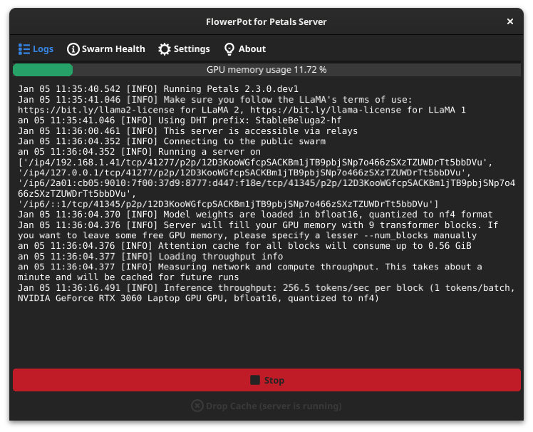
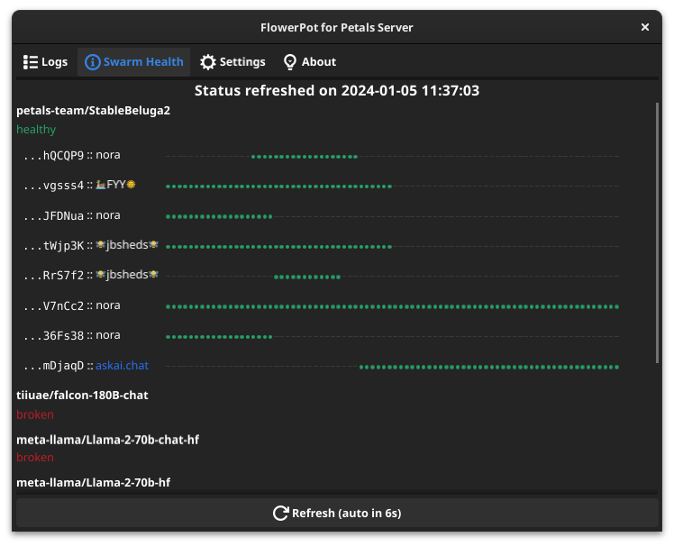
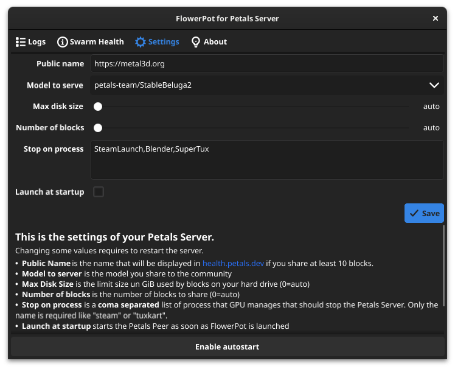

# FlowerPot - User Friendly UI for Petals

FlowerPot is a graphical interface to launch a [Petals](https://petals.dev) Peer in the Petals Swarm. It also proposes to start and strop the peer in certain conditions (gaming, computing, ...). 

> Running a peer helps the community to use Large AI Models on several computers. See the [Petals](https://petals.dev) website for more information.

<div align="center">



</div>

## What is Petals?

Petals is a project to create a "swarm" of computers that launches a part of a "LLM" (Large Language Model) like are GPT, Bloom or even LLaMA.

Normally, this type of model is too large for a personal computer, which is why the "big players" who offer chat services with AI pay a lot of money for adapted and specialized machines. 

Passionate developers were then limited in their ability to test, develop and offer services using this type of model. This was the preserve of the big companies, **until Petals came along**.

Now, Petals lets you divide models into "blocks" and have several computers, including your own, do a small part of the calculation. You can become part of this "swarm" of machines by launching a "petals" service.

> FlowerPot is simply an interface that makes it easy to set up and automatically start this service. That's all there is to it.

## Install

### Linux

The easiest method is to follow the "auto install" script. Open a terminal and type:

```bash
curl -sL https://raw.githubusercontent.com/metal3d/flowerpot/main/install.sh | bash
```

This will:

- download the latest release in a temporary directory
- unpack and install FlowerPot in the user directory (`~/.local/share`)
- add the desktop entry
- cleanup

Then, you can launch FlowerPot interface.

It will then install petals server (Python project). That's all. You can then press the "Start button".

> Go to the settings to make it start at login. And check "auto start" to make it start as soon as possible.

### Windows / Mac

At this time, we do not support these them, but it's in progress. We need help...


## How is FlowerPot developped?

FlowerPot is developped with "Go" and the fantastic [Fyne.io](https://fyne.io) library to make the graphical interface. It doesn't use any web renderer, it's cross-platform and native. We decided to use Go to ease the installation and avoid dependencies.

We could, of course, use Python with Gnome / Adwaita libraries, Tkinter, or even Qt. The fact is that is would make it a bit more complex to install it on Windows. As we want to make it work on these platforms too, Go + Fyne is way simpler. We built, you install. Nothing more.

## Help wanted

I haven't got any computer on Window or Mac. Linux is my OS, I use it to work, play, music composition, 3D, photo... But I'm aware that a lot of users are Windows consumers.

I need at least one Windows user that gives me solution to make these:

- the installation process of "petals" client
- the method to get `nvidia-smi` output
- some checks on task list to "stop" the server like I do on Linux when certain software need the GPU

If you're interessed, please go to the discussion page to share your help.
